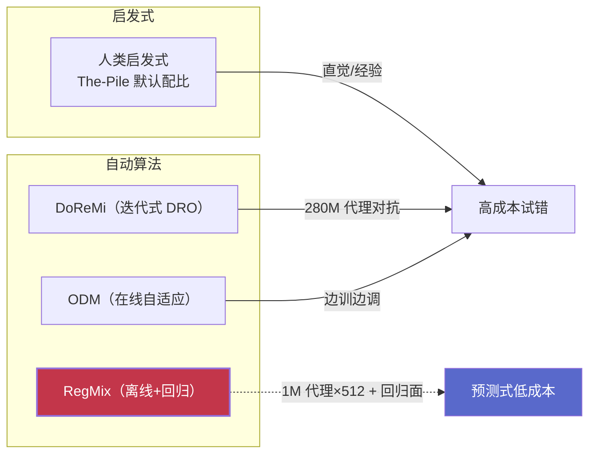
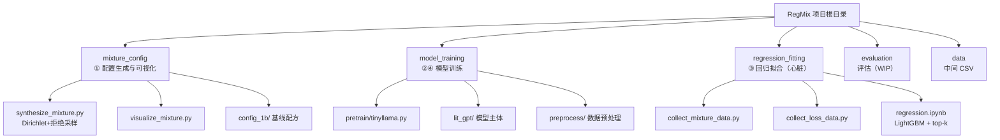
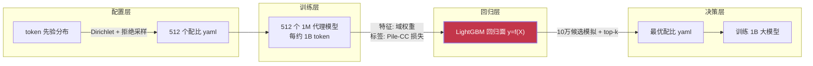
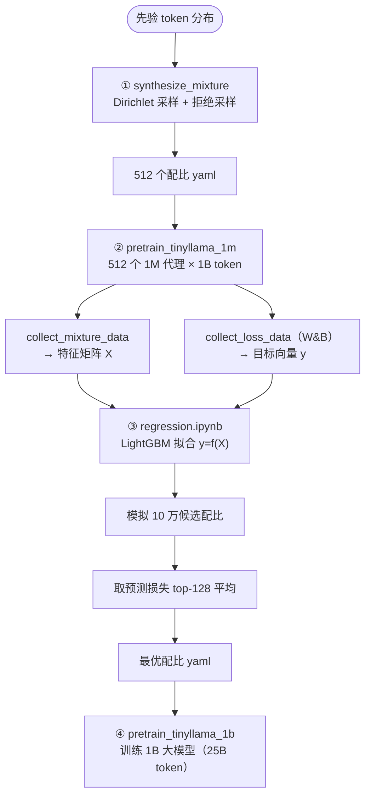
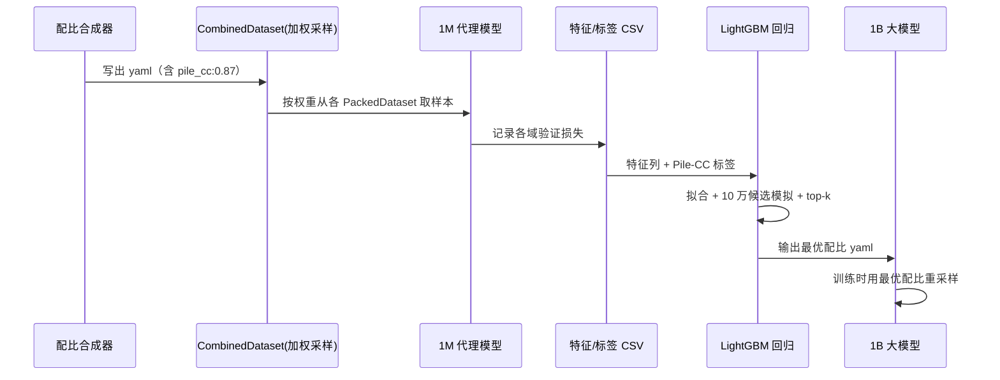

# 第一观 · 整体观：给 RegMix 画一张"项目认知地图"

> 三观递进三部曲 · 第一篇
> 本文回答三个问题：**RegMix 是什么？它在哪片生态里？整个项目如何一点点搭起来？**
> 阅读路径：看见全貌 →（下一篇）看懂算法 →（再下一篇）看透本质。

---

## 一、总：一句话抓住 RegMix

**RegMix（RegMix: Data Mixture as Regression for Language Model Pre-training，arXiv 2407.01492，ICLR 2025）把"预训练话语料该怎么配比"这件事，从一个凭经验拍脑袋的苦差事，改写成了一道回归题。**

大型语言模型（LLM）的能力很大程度由预训练语料的**域混合比例**（各领域数据各占多少）决定。但"维基百科该占 8% 还是网页该占 60%"这类问题，传统上靠工程师的直觉、经验法则，或动辄训练成千上万个候选模型来试错——成本极高且未必最优。RegMix 的核心洞察极其朴素却有力：

> 与其在不可导的、昂贵的大模型上"搜索"最优配比，不如把"配比 → 模型损失"这条曲线先"拟合"出来，然后在便宜的曲线上"预测"最低点。

- **它解决什么**：用微小代价（512 个 1M 参数的代理模型、共约 1B token/个）自动找出大模型（1B、乃至 7B）的最优数据配比，显著优于人工选择的方案，并以约 **DoReMi 的 1/10 计算量**达到甚至超过 DoReMi 的效果。
- **核心价值**：把"数据配比"从黑箱经验变成**可预测的科学**，把大规模实验的昂贵成本透过"代理模型 + 回归"层层摊薄。
- **本质一句话**：数据混合不是玄学，而是一张可以被小模型先量出来、再用于训练大模型的**平滑响应曲面**。

下面，我们从"生态定位"开始，一步步走进这个项目的内部。

---

## 二、分：层层展开

### 2.1 项目定位与生态定位：它站在"数据混合"研究坐标系的哪一格？

预训练话语料配比是 2022 年以来 LLM 基础设施研究的热点。我们可以用两条正交的轴给这一领域画一张图：



**图注 1：数据混合研究的坐标系。** 横轴是"离线预测 vs 在线自适应"，纵轴是"人类启发式 vs 自动算法"。RegMix 落在"离线 + 自动"的一格：训练开始前就一次性决定配比，且配比由回归算法自动算出（红色高亮）。

- **人类启发式**（Human / The-Pile 默认配比 [Gao et al., 2020]）：靠直觉，不可扩展、未必最优。
- **在线自适应**（Online Data Mixing, ODM [Albalak et al., 2023]）：训练过程中用多臂老虎机动态调配比，灵活但引入额外开销。
- **自动、离线、迭代式**（DoReMi [Xie et al., 2023]）：先训个参考模型，再用 Group DRO 训代理模型得到域权重，最后用该权重训大模型——但它仍是"训练中的动态机制"，且需训参考+代理两轮。
- **自动、离线、预测式（RegMix）**：与 DoReMi 最直接的对照。DoReMi 用一个 280M 代理模型通过 minimax 对抗式地"逼"出权重（约为主模型 8% 计算量）；RegMix 用一批 1M 代理模型（更小）先**采样多种配比 → 采集损失 → 拟合回归面**，再**在回归面上取最低点**（只要 DoReMi 约 10% 计算量）。这就是本项目在生态中的独特坐标。

> 一句话：在同一片田野里，DoReMi 是"边种边比较哪块地收成好"的农人，RegMix 是"先画一张产量地形图再挑最高点"的测绘员。

### 2.2 整体代码结构：四层组件，一条数据流

`/workspace` 的项目目录由四个模块构成，恰好对应论文的四步流水线：

```
RegMix/
├── README.md                    # 项目总览 + 使用指南
├── mixture_config/              # ① 混合配置生成与可视化
│   ├── synthesize_mixture.py    #    Dirichlet+拒绝采样 生成多样配比
│   ├── visualize_mixture.py     #    可视化各域权重分布
│   └── config_1b/               #    1B 实验的基线配方（human/doremi/pile_cc/regmix）
├── model_training/              # ②④ 训练 1M 代理 / 1B 大模型
│   ├── pretrain/tinyllama.py    #    训练主脚本（混合配比→加权采样）
│   ├── pretrain_tinyllama_1m.sh #    1M 代理模型启动脚本
│   ├── pretrain_tinyllama_1b.sh #    1B 大模型启动脚本
│   ├── lit_gpt/                 #    模型主体+极致工程（融合内核/打包数据）
│   └── preprocess/              #    数据预处理（gptneox tokenizer 等）
├── regression_fitting/          # ③ 回归拟合（本项目的心脏）
│   ├── collect_mixture_data.py  #    配置→特征 CSV
│   ├── collect_loss_data.py     #    W&B 损失→目标 CSV
│   └── regression.ipynb         #    LightGBM 回归 + top-k 最优混合
├── evaluation/                  # 评估（WIP）
└── data/                        # 已备好的回归训练/测试 CSV
```



**图注 2：目录结构即流水线。** 四个顶层目录一一对应"生成配置→训练代理→拟合回归→训练大模型"四个步骤；`data/` 是全流程的中间物（CSV），`regression_fitting` 是左侧这颗"心脏"。

结构设计上有一个鲜明的取舍：**按"数据流阶段"组织，而非按"类/模块"组织**。每个目录对应论文的一个实验阶段，目录边界就是数据产物的边界——一个阶段的产物（yaml / csv / yaml）正是下一阶段的输入。这让复现和扩展非常直观：想换数据集，只改 ① 里的先验即可。

### 2.3 设计理念与架构模式：三层解耦 + proxy surrogate

这个项目凝聚了三个可迁移的设计理念：

1. **阶段解耦（pipeline decoupling）**：四步之间只通过**文件**（yaml 配置、CSV 数据、yaml 最优配方）通信，彼此无代码耦合。你可以自由替换任意一步的实现，而不影响其余步骤。
2. **代理-目标分层（proxy → target surrogate）**：这是全项目最核心的哲学。用小而便宜的 1M 模型"代理"昂贵大模型的"配比-性能"关系，从而把成本从「训一次大模型的代价」摊薄到「训 512 个 1M 模型的代价」。
3. **"数据即特征、损失即标签"**：`regression_fitting` 把每一个 yaml 配比（一个 `train_域: 权重` 向量）当作特征向量 `X`，把代理模型在 Pile-CC 上的验证损失当作标签 `y`。于是"找最优配比"被翻译成一句再普通不过的话：**拟合 `y = f(X)`，然后在定义域内找让 `y` 最小的 `X`**。



**图注 3：四层架构。** 配置层产出多样配比样本，训练层产出每个配比下的损失，回归层学习"配比→损失"映射（全项目心脏，红色），决策层在映射面上取最小点作为最终配方。箭头表示数据文件流。

### 2.4 实现原理概述：四步流水线的高层头脑



**图注 4：RegMix 端到端流程。** 从先验 → 512 个配比 → 512 个 1M 代理模型 → 拟合 LightGBM → 模拟 10 万候选 → top-k 平均 → 训练 1B 大模型。每一步的产物是下一步的输入。

- **步骤① 生成配置**（`mixture_config/synthesize_mixture.py`）：以 The Pile 的 17 个域的 token 先验为基准，用 **Dirichlet 分布**配合**拒绝采样**，生成 512 个互不相同、覆盖"均匀↔集中"两端的配比 yaml。它还编码了建模偏好：每个域权重有下限（`MINIMUM=2e-4`，保证该域至少被采到、统计显著）与上限（`MAXIMUM_USAGE=15`，防止某域被过度重复）。
- **步骤② 训练代理模型**（`model_training/pretrain_tinyllama.py` + `_1m.sh`）：对每个配比训练一个 1M 参数的 TinyLlama 式模型，各训约 1B token（`max_step=1001`）。训练细节极简克制——**常数学习率**、不做模型落盘、只用 W&B 记录损失——因为目的不是得到好模型，而是**得到一条"配比→损失"的测量值**。
- **步骤③ 拟合回归**（`regression_fitting/regression.ipynb`）：特征 = 17 维域权重，标签 = 代理模型在各域验证集上的损失（默认取 Pile-CC）。用 **LightGBM（GBDT）** 拟合多个目标（每个域一个预测器），用测试配比做 early stopping，用 **Spearman 相关**衡量拟合质量。
- **步骤④ 决策并训练大模型**（`_1b.sh` + `config_1b/*.yaml`）：在步骤③的回归面上做"虚拟实验"——从先验附近采样 10 万个候选配比，用训练好的 Pile-CC 预测器逐个打分，取**预测损失最低的 top-128 平均**作为最终最优配方，写入 yaml，喂给 1B 大模型训练（25B token）。

### 2.5 整体流程：一份配比的数据漫游

我们跟随一份 `train_the_pile_pile_cc: 0.87` 的数字，看它如何在系统里流动（时序视角）：



**图注 5：数据漫游。** 一个权重值从 yaml 出生（合成器）→ 进入 1M 训练的采样器（按权重重采样）→ 变成 CSV 特征列 → 参与回归 → 成为最优配方的一部分 → 决定 1B 模型每个 batch 里 Pile-CC 占多少。

关键工程点：配比的应用发生在**数据采样层**，而非损失加权层。`tinyllama.py` 里把 yaml 权重归一化后交给 `CombinedDataset`，按比例从各域的 `PackedDataset` 中取样本——**这是"重采样（reweighting by sampling）"路线**，与 DoReMi 的"在线损失重加权"是两条不同技术路线。

---

## 三、总：给项目画一张像

把上面的一切收拢成一段话：

**RegMix 是一个"先测量、后预测、再放大"的预训练数据配比优化系统。** 它用 512 个 1M 的廉价代理模型，在大规模昂贵训练之前，先把"配比 → 损失"的响应曲面低成本地测绘出来；再用一个回归模型（LightGBM）把这个曲面可预测地参数化；最后在这个曲面上挑选损失最低的配比，把千分之一计算量的结论放大到千倍规模的大模型训练上。它最了不起的，不是某个花哨的神经网络，而是一种**思维方式**：当一件事太贵而无法直接搜索时，就先找一个便宜的替身去"摸清地形"。

> 补充插图：仓库自带 `../misc/method_figure.png`（论文方法示意图）、`../misc/prior_vs_regmix.pdf`（先验 vs RegMix 权重对比）、`../misc/weight_distributions.png`（采样权重分布）、`../misc/1m_pile_cc_loss.pdf`（1M 模型 Pile-CC 拟合散点）。

---

## 四、附：使用指南与实战案例

> 本节把"怎么跑通 RegMix"和"它在一个真实场景下改出了什么"讲清楚，方便读者直接上手并理解输入/输出。

### 4.1 端到端使用指南（在自己数据集上）

RegMix 的入口是改 `get_token_distribution()`，其余步骤基本是模板化的命令。下面按步骤给出可直接执行的命令（假设你的数据集短名为 `your_dataset`，含 `domain1/2/3` 三个域）：

1. **改先验**：编辑 `mixture_config/synthesize_mixture.py` 里的 `get_token_distribution()`，返回 `{"train": {各域占比}, "valid": {各域 1.0}}`。三个域示例：

```python
def get_token_distribution():
    train = {
        "train_your_dataset_domain1": 0.33,
        "train_your_dataset_domain2": 0.33,
        "train_your_dataset_domain3": 0.34,
    }
    valid = {
        "valid_your_dataset_domain1": 1.0,
        "valid_your_dataset_domain2": 1.0,
        "valid_your_dataset_domain3": 1.0,
    }
    return {"train": train, "valid": valid}
```

2. **生成 512 个配比**（也支持更少的数量做小规模验证）：

```bash
cd mixture_config
python synthesize_mixture.py --num_configs 512 --output_folder ../config_1m
python visualize_mixture.py --config_folder ../config_1m   # 可选：看看权重分布
```

3. **训练 512 个 1M 代理模型**（每个约 20 分钟/A100，共约 170 GPU·小时）：

```bash
cd ../model_training
for i in {1..512}; do ./pretrain_tinyllama_1m.sh $i; done
```

4. **汇总数据 + 拟合回归**（先配好 `collect_loss_data.py` 里的 W&B API key 与 project）：

```bash
cd ../regression_fitting
python collect_mixture_data.py --write_file_path train_mixture_1m.csv --config_folder ../config_1m
python collect_loss_data.py --write_file_path train_pile_loss_1m.csv
# 打开 regression.ipynb 运行全部单元格，得到最优混合
# 把结果存成 ../mixture_config/config_1b/optimal_mixture.yaml
```

5. **训练大模型**：

```bash
cd ../model_training
./pretrain_tinyllama_1b.sh optimal_mixture
```

**调参经验（来自 README 的 Tips）**：① 配比数量是影响回归精度最大的杠杆，域越多越要多训代理；② 即使资源少，也可以先训少量配比试试回归能否外推到未见配比；③ 目标损失选"高质量且多样"的验证集（如 Pile-CC），对通用下游性能泛化最好。

### 4.2 实战案例：The Pile 的 17 域配比之争

RegMix 论文在 The Pile 的 17 个域（arxiv、book、github、wikipedia、pile_cc、gutenberg 等）上做了最经典的一场实验。仓库里 `mixture_config/config_1b/` 存着几份"竞争对手配方"，也存着 RegMix 的答案。

- **Human（The Pile 默认）**：人工直觉，pile_cc 约占 0.24，各域按原始体量分配。
- **DoReMi**：`doremi.yaml` 里 pile_cc 占到 **0.6057**——这是它用 DRO 逼出来的重心。
- **RegMix 最优**：论文 README 里的 `optimal_mixture` 把 pile_cc 推高到 **0.8701**，而 arxiv 等"看似高质量"的域被压到千分之一量级。

这个反直觉的结果（*网页语料比维基百科更关键*、*域之间存在复杂的交互*）只有自动方法才挖得出来，也正是论文四大发现的核心。你可以直接用仓库自带的 `data/` 下 CSV 复现这份配比：

```bash
# 用 data/ 里的现成数据跑通回归notebook即可
# data/train_mixture_1m.csv  → 特征
# data/train_pile_loss_1m.csv → 标签
```

**案例小结**：这份案例展示了 RegMix 的"照妖镜"作用——它把人类对"高质量数据"的直觉（多喂维基百科）证伪了，转而指向了真正的效能来源。这也是"配比优化值得自动化"最有力的论据。

---

**下一篇预告**：我们已经"看见"了全貌。接下来《第二观·具体观》将潜入这些算法内部——Dirichlet 怎么采样、LightGBM 怎么拟合、top-k 怎么挑、重采样和重加权到底差在哪，并逐一用论文和代码例子讲透。