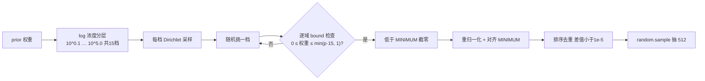
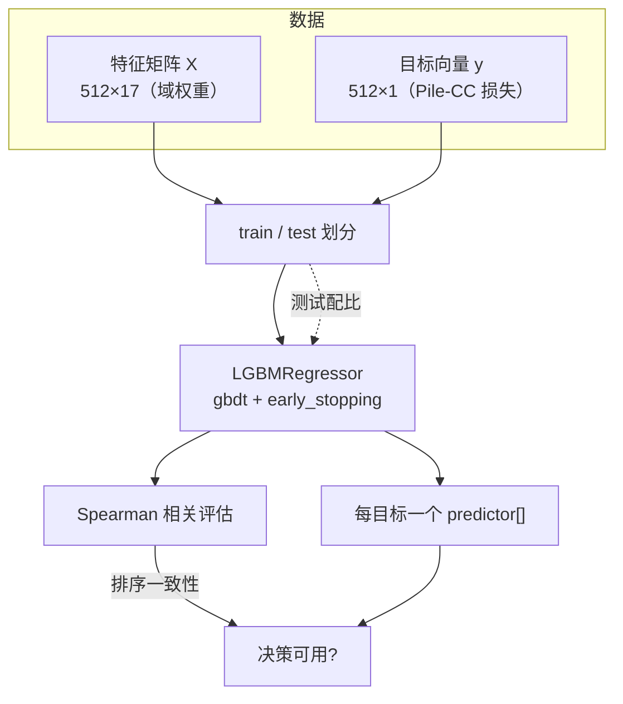
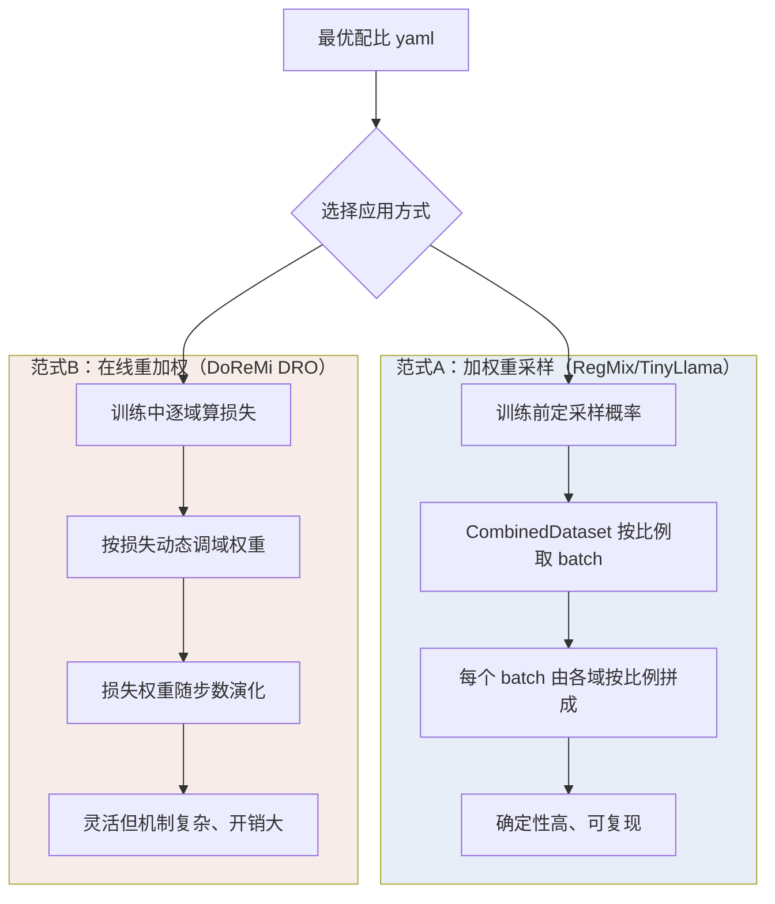

# 第二观 · 具体观：把 RegMix 的算法逐颗螺丝拧开看

> 三观递进三部曲 · 第二篇
> 承接上一篇的"整体观"，本篇下沉到代码与数学：**每个核心技术点先说学术原理（附论文）→ 再贴真实代码 → 最后用例子讲透。**
> 阅读路径：看懂配置采样、看懂回归拟合、看懂 top-k 决策、看懂训练工程。

---

## 一、总：值得深入的技术点清单

RegMix 的提案本身是"回归"二个字，但把一套系统跑起来，靠的是五个互相咬合的技术点。按它们在流水线中出现的顺序：

| # | 技术点 | 一句话 | 所在文件 |
|---|--------|--------|----------|
| 1 | Dirichlet 采样 + 拒绝采样 生成多样配比 | 如何让 512 个配比"多变但不离谱" | `mixture_config/synthesize_mixture.py` |
| 2 | LightGBM（GBDT）回归拟合 | 如何把"配比×域"映射到"损失" | `regression_fitting/regression.ipynb` |
| 3 | top-k 模拟决策 | 如何在回归面上"虚拟搜索"最优配比 | `regression.ipynb` |
| 4 | 打包 + 加权重采样 | 如何高效地按配比喂数据 | `model_training/pretrain/tinyllama.py`、`lit_gpt/packed_dataset.py` |
| 5 | 极致工程（融合内核、W&B-only 不落盘） | 如何把 512 次小训练的开销压到极致 | `lit_gpt/`、`pretrain/` |

下面逐一展开，每个点采用「论文 → 代码 → 例子」三步。

---

## 二、分：逐个技术点深入

### 2.1 技术点一：Dirichlet 分布 + 拒绝采样，造出 512 个"言之有物"的配比

#### 原理（论文支撑）

生成多样配比，本质是在 **概率单纯形（simplex）** 上采样。单纯形 `Δ = {x ∈ R^K : x_j ≥ 0, Σx_j = 1}` 是所有配比所在的空间——任意一个 17 维配比向量都落在这个"下比较为多边形的面积"上。

- **Dirichlet 分布**是定义在单纯形上的标准分布，记为 `Dirichlet(α₁,…,α_K)`。它有两个关键开关：
  - **均值**由 `α` 的比例决定 → 采样中心大致沿着先验分布走；
  - **浓度（total strength = Σα）** 决定"紧贴中心"还是"撒得很开"：浓度大 → 配比集中在均值附近（更像先验）；浓度小 → 配比均匀粗犷地在单纯形上铺开。
- **拒绝采样（reject sampling）**：先生成一批候选，`ensure_flag` = 逐域检查是否落在允许区间 `[0, min(prior·MAXIMUM_USAGE, 1)]`，不在就丢弃。这样能把"重采某个域太多"这类物理上不合理（会导致重复多遍、训练浪费）的候选挡在门外。

论文关联：Dirichlet 作为在 simplex 上平滑采样的标准工具，文献可直接参考 [Dirichlet 分布的维基页/标准教材]。而"为什么配比多样性对预测重要"，同源工作 [Data Mixing Laws（arXiv 2403.16952）](https://arxiv.org/abs/2403.16952) 指出：**域损失是配比的连续函数、可以离线预测**——这正是"采样多样配比→拟合→外推"能成立的先验。这也是本技术点的存在理由。

#### 代码实现

`mixture_config/synthesize_mixture.py` 的核心在 `generate_weights_dirichlet()`。

```python
# 关键常数（摘自查号）
MIN_STRENGH, MAX_STRENGH = 0.1, 5.0     # 浓度的对数空间下界/上界
MINIMUM = 2e-4                          # 最小取样率：保证统计显著
MAXIMUM_USAGE = 15                      # 单域最大"被用次数"

# 每个域的可接受上界（拒绝采样的 bound）
number_bound = [[0.0, min(prior_dist[i] * MAXIMUM_USAGE, 1.0)]
                for i in range(len(prior_dist))]

# 在不同"浓度"下各采一批：从 10^0.1 到 10^5.0 对数均匀取 15 档
for strength in np.logspace(np.log10(MIN_STRENGH), np.log10(MAX_STRENGH), 15):
    samples_per_strength = np.random.dirichlet(prior_dist * strength, 1)
    samples.append(samples_per_strength)
samples = random.choice(samples)          # 随机挑一个浓度档

# 拒绝采样 + 阈值截断 + 重新归一化
if samples[0][j] > number_bound[j][1]:    # 超出上限 → 丢弃该候选
    ensure_flag = False
samples = np.where(samples < MINIMUM, 0.0, samples)  # 低于下限 → 截为 0（视为"不含该域"）
samples = samples / np.sum(samples, axis=1, keepdims=True)
samples = np.round(samples / MINIMUM) * MINIMUM      # 对齐到 MINIMUM 的整数倍（去冗余）
```

采样 ×100 倍后经 `sort_and_deduplicate` 去重 `np.sum(|a−b|)` < 1e-5 的重复配比，再 `random.sample` 抽足 512 个。

#### 具体例子

假设只有 3 域，先验 `[0.5, 0.3, 0.2]`，MINIMUM=0.05，MAXIMUM_USAGE=2：

- 浓度 `strength=5.0` 时，`Dirichlet([2.5,1.5,1.0])` → 采样靠近 `[0.5,0.3,0.2]`；
- 浓度 `strength=0.1` 时，`Dirichlet([0.05,0.03,0.02])` → 采样在单纯形上均匀乱飞，可能出现 `[0.15,0.8,0.05]` 这种极端配比；
- 拒绝采样：`bound = [0, min(0.5*2,1)=1.0]×3`，好；若某候选某域到 0.99，仍合法。但若某个测试用 `prior[wikipedia]=0.05`、`MAXIMUM_USAGE=15`，其 bound 上限 0.75 —— 意味着不该把维基百科喂到 90%，防止把 1B token 里 90% 都重复维基百科。

**理解要点**：这套采样不是"均匀随机"，而是"围绕先验、按强度分层、带物理约束"的探索——既要覆盖均匀多数，也要覆盖贴近人类直觉的先验附近。多样的 `X` 才让回归面能被充分观测。

下图把"采样-约束-截断-去重"的流水线画出来：



**图注 1：Dirichlet + 拒绝采样生成配比的流程。** 对数浓度分层采样 → 单域 bound 检查（拒绝采样）→ 低于 MINIMUM 截零 → 重归一化 → 对齐去重 → 抽 512 个。每一步都在保证"多样且物理合理"。

### 2.2 技术点二：LightGBM（GBDT）拟合"配比 → 损失"

#### 原理（论文支撑）

- **GBDT 的核心思想**（Friedman 2001）：用一组浅决策树逐步拟合理应与预测减小的"残差"，最终预测 = 所有树的加权和。
- **LightGBM**（[LightGBM: A Highly Efficient Gradient Boosting Decision Tree，Ke et al.，NeurIPS 2017](https://papers.nips.cc/paper/6907-lightgbm-a-highly-efficient-gradient-boosting-decision-tree)）做了两大工程创新，让 GBDT 在"样本/特征中等规模、数据量大"时快几十倍：
  1. **GOSS（Gradient-based One-Side Sampling）**：只保留梯度大的样本、对梯度小的随机抽样，精确估计分裂增益；
  2. **EFB（Exclusive Feature Bundling）**：把互斥特征捆绑，减少有效特征数。
- 对 RegMix 而言，为什么偏偏选树模型而非线性/MLP？因为**"配比→损失"天然是分段平滑、带强交互、甚至反直觉的非线性关系**（论文发现域之间交互复杂、常与常识相悖）。树模型无需先验函数形式、能自动捕捉交互，且可解释（可查特征重要度）。

#### 代码实现

`regression_fitting/regression.ipynb`：

```python
import lightgbm as lgb
from scipy.stats import spearmanr

hyper_params = {
    'task': 'train', 'boosting_type': 'gbdt', 'objective': 'regression',
    'metric': ['l1', 'l2'], 'num_iterations': 1000,
    'seed': 42, 'learning_rate': 1e-2, "verbosity": -1,
}

predictor = []
for i in range(len(KEY_METRICS)):          # 每个域/每个目标各训一个预测器
    gbm = lgb.LGBMRegressor(**hyper_params)
    reg = gbm.fit(X_train, y_train[:, i],
        eval_set=[(X_test, y_test[:, i])], eval_metric='l2',
        callbacks=[lgb.early_stopping(stopping_rounds=3, verbose=False)])
    r, _ = spearmanr(reg.predict(X_test), y_test[:, i])
    print(i, KEY_METRICS[i], "Correlation:", np.round(r*100, 2))
    predictor.append(reg)
```

注意两个工程细节：**① 每个目标（Pile-CC、各域 val loss）独立训一个预测器**；**② 用测试配比做 L2 early-stopping 防过拟合**，并以 **Spearman 相关**（排序相关，而非线性相关）评价——因为决策只关心"哪个配比更优"的相对排序，不关心绝对损失，Spearman 正契合这个目标。

#### 具体例子

- 输入特征 `X`：一行 = 一个配比（17 列，各列是某个域权重）。
- 目标 `y`：同一配比下 1M 代理模型在 Pile-CC 上的验证损失。
- 训练集/测试集：`data/train_mixture_1m + train_pile_loss_1m` 与 `data/test_*` 成对使用。仓库 `misc/1m_pile_cc_loss.pdf` 就是真值与预测的联合散点图——若散点贴近 45° 直线、Spearman 在 0.9 量级，说明"预测的排序与真实排序高度一致"，决策可信。

**理解要点**：回归拟合的质量目标不是"骗过 RMSE",而是"排序正确"。之所以能用 Spearman，是因为最终只做 top-k 挑选——只要排序对，挑出来的配比就接近最优。

回归管道可以抽象成下图：



**图注 2：回归拟合管道。** 特征=域权重、目标=某域验证损失；train/test 划分后训练 LightGBM（用测试集 L2 early stopping），用 Spearman 相关评估"排序一致性"，为每个目标保存一个预测器。Spearman 高 → 决策可信。

### 2.3 技术点三：top-k 模拟——在回归面上"纸上谈兵"地找最优

#### 原理（论文支撑）

真实的大模型无法试 10 万个配比；但有了回归面 `ŷ = f(X)` 之后，可以用**蒙特卡洛模拟**在定义域（单纯形）内廉价采样、预测、比较。最优配比近似为：

```
X* ≈ mean( argmin_{top-k} f(X_sim) )
```

- 为什么要 **top-k 平均**而非直接取预测损失最小的单个点？因为回归面由 proxy 测得、含噪声，取单个最小值点会"过拟合噪声"、产生尖锐的不可重复配比；取 top-k 平均则得到一个**鲁棒、平滑、可复现**的中心估计——这与集成/聚类的去噪直觉一致。论文也强调"取平均值得到最优混合"（`optimal_data_mixture = np.mean(top_k_samples, axis=0)`）。
- 这是"离线预测式"方法的精髓：**把昂贵的搜索换成廉价的采样+打分**。与之相对，DoReMi（[Xie et al., NeurIPS 2023，arXiv 2305.10429](https://arxiv.org/abs/2305.10429)）是在训练中用 Group DRO 在线地逼出权重——代价高、机制复杂；而 top-k 模拟只需一两次矩阵运算。

#### 代码实现

```python
# 10 万个候选配比：围绕先验做 Dirichlet 采样
samples = np.random.dirichlet(prior_dist * 1, 100000)

# 用 Pile-CC 的预测器给每个候选打分
simulation = predictor[selected].predict(samples)

# 取预测损失最低的 k=128 个，平均即最优配比
k = 128
top_k_samples = samples[np.argsort(simulation)[0:k]]
optimal_data_mixture = np.mean(top_k_samples, axis=0)
```

`prior_dist` 是 17 个域的原始 token 分布（如 `arxiv 0.1133`, `pile_cc 0.2369` 等），用它做采样中心，保证候选配比集中在"现实中可能的"区间里。

#### 具体例子

- 先验里 `pile_cc≈0.237`；RegMix 预测出的最优配比里 `pile_cc≈0.870`。这说明回归面告诉我们：在 `predicted(Pile-CC loss)` 最小的一组配比里，把网络文本（pile_cc）顶到接近单一主导的水平是最优的——**这与"多喂高质量专业域（arxiv/wikipedia）"的直觉截然相反**（论文发现 web 语料与下游效能正相关最强）。
- 这正是"论文证明需要自动方法"(论文发现 ③)的落地证据：人拍脑袋拍不出 `pile_cc=0.87`，只有"回归+模拟"能。

**理解要点**：top-k 是"鲁棒化"与"决策化"的桥梁——把回归面这个函数，安全地变成一个可用的配方。

### 2.4 技术点四：打包 + 加权重采样，把配比"物理化"

#### 原理（论文支撑）

配比要落地到训练，有两种范式：

| 范式 | 做法 | 代表 |
|------|------|------|
| **在线重加权（reweighting by objective）** | 训练中动态调整损失权重 | DoReMi 的 Group DRO 路线 |
| **加权重采样（reweighting by sampling）** | 训练前按比例决定每个 batch 从哪个域取 | **RegMix / TinyLlama 路线** |

RegMix 选后者：**把配比编码进"采样概率"，而不是"损失权重"**。好处是简单、确定性强、天然符合"每个域贡献多少 token"的语义。数据打包上，采用 TinyLlama 的 `PackedDataset`——把变长样本拼成等长块，避免 pad token 浪费、也天然支持在 batch 之间随机打乱域混合。

论文关联：加权重采样是主流 LLM 预训练的事实标准，TinyLlama 技术本身即承袭自该生态；"打包采样"的工程成熟做法可参见开源训练栈 [lit-gpt](https://github.com/Lightning-AI/lit-gpt)。

#### 代码实现

`model_training/pretrain/tinyllama.py` 的 `create_train_dataloader`：

```python
datasets = []
for idx in range(len(data_config)):
    prefix = data_config[idx][0]                  # 如 train_the_pile_pile_cc
    filenames = sorted(glob.glob(str(data_dir / f"{prefix}-*")))  # 前缀匹配
    dataset = PackedDataset(filenames, n_chunks=1,
                            block_size=block_size, shuffle=True,
                            seed=seed + fabric.global_rank, ...)
    datasets.append(dataset)

weights  = [w for _, w in data_config]            # 取各域权重
weights  = [w / sum(weights) for w in weights]    # 归一化成采样概率
combined_dataset = CombinedDataset(datasets, seed=seed, weights=weights)
```

注意 `prefix-*` 的 glob 用 `-` 连字符做域边界，README 特别警告"前缀必须唯一、且用 `-` 避免一个前缀成为另一个前缀的子串"——一个不起眼却极易踩的坑（否则 python 会错误地把 `pile_cc` 配对的样本也当 `pile` 的）。

#### 具体例子

配置 `{pile_cc: 0.87, arxiv: 0.001}`：归一化后，`CombinedDataset` 每取出一个 batch，约 87% 的样本来自 pile_cc，仅约 0.1% 来自 arxiv。数学上，某个域对参数梯度梯度的预期贡献正比于其采样概率 × 其损失。

**理解要点**：重采样路线把"配比"翻译成"每个 batch 由哪些域拼成"，简单、透明、可复现；配合打包机制，几乎零样本浪费。

### 2.5 技术点五：极致工程——把 512 次小训练的每一点开销都压干

#### 原理与代码

1. **W&B-only，不落盘**：`synthesize_mixture.py` 生成的配置里 `save_step_interval: 2000` 大于 `max_step: 1001`——**迫使模型从不保存 checkpoint**。因为代理模型只是"测量仪器"，不需要留权重；全部信息通过 W&B 的 loss 记录留存。这从根上省掉了 512 份模型的海量存储与 I/O。
2. **常数学习率**：代理模型用恒定 `lr=0.0004`(`min_lr=lr`)，不做 cosine decay——收敛曲线线性稳定，方便在 `global_step=1000` 精确取值做回归标签（见 `collect_loss_data.py` 的 `SELECT_STEP=1000`）。
3. **融合内核**：`lit_gpt/rmsnorm.py`（RMSNorm）、`fused_rotary_embedding.py`（RoPE）、`fused_cross_entropy.py`（cross-entropy）等都提供 torch 融合实现，把归一化/位置编码/损失的计算压低到更少 kernel launch，加速 1M 与 1B 训练。
4. **数据预打包**：`lit_gpt/packed_dataset.py` 把 token 序列 zstd 压缩打包成 `packed.bin`，训练时按块读取、无空洞随机访问，IO 远快于逐样本 jsonl。

下图综合展示两种范式与工程取舍：



**图注 3：两种"配比落地"范式的对比。** 左：加权重采样（RegMix），训练前定采样概率、采样时体现比例；右：在线重加权（DoReMi），训练中按域损失动态调权重。RegMix 选择左侧以换取简单、确定、可复现。

#### 具体例子

假设目标 1M 代理训练共约 1B token：若 `save_step_interval=2000`，模型一层不落、仅 W&B 记录——512 个配比训练下来，磁盘上几乎只有 CSV，没有 512 个权重目录。这就是"测量优先、产物精确"的工程哲学。

---

## 三、总：这些技术如何共同支撑同一个目标

把五个点串起来：**Dirichlet+拒绝采样**负责把定义域铺满有意义的样本；**LightGBM**把这个定义域上的"配比→损失"映射稳健地学出来（关键是用 Spearman 保证"排序对"）；**top-k 模拟**在学好的面上低成本地挑出鲁棒最优；**加权重采样+打包**把最优配比忠实地落到 token 流；**极致工程**则确保 512 次代理实验成本足够低、可落地。五者合起来，完成了一件看似不可能的事——**用不到大模型 1% 的计算，预测并复现出大模型的最优数据配方**。

> 补充论文（供深入）：
> - [DoReMi: Optimizing Data Mixtures Speeds Up Language Model Pretraining（Xie et al., NeurIPS 2023）](https://arxiv.org/abs/2305.10429) — 基线方法；用 Group DRO 在线求域权重，RegMix 以约 1/10 计算量追平/超越它。
> - [RegMix 论文（Liu et al., ICLR 2025）](https://arxiv.org/abs/2407.01492) — 本仓库即其官方实现；提出"数据混合即回归 + rank invariance 假设"。
> - [Training Compute-Optimal LMs（Chinchilla，Hoffmann et al., 2022）](https://arxiv.org/abs/2203.15556) — 计算最优缩放；RegMix 借此确定 1B 代理/25B token 的大模型预算与"20 token/参数"量级。
> - [Data Mixing Laws（Ye et al., 2024）](https://arxiv.org/abs/2403.16952) — 数据混合的离线可预测性；与 RegMix 同属"离线预测"路线。
> - [Data Mixing Made Efficient: Bivariate Scaling Law / BiMix（Ge et al., 2024）](https://arxiv.org/abs/2405.14908) — 用更少系数拟合混合缩放律；可与 RegMix 形成对照。
> - [LightGBM（Ke et al., NeurIPS 2017）](https://papers.nips.cc/paper/6907-lightgbm-a-highly-efficient-gradient-boosting-decision-tree) — 回归器本体，GOSS+EFB 保证大样本快拟合。

---

**下一篇预告**：我们已经"看见"了全貌、"看懂"了算法。最后《第三观·深刻不忘观》将跃出水面问三个更深的问题：为什么"数据混合"居然可以被回归？这套"测量-拟合-放大"的心法还能搬到哪些战场？以及把它凝练成一句让你永生不忘的话。