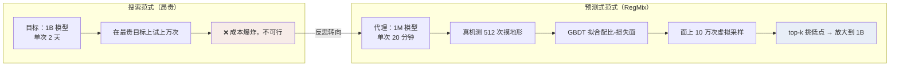
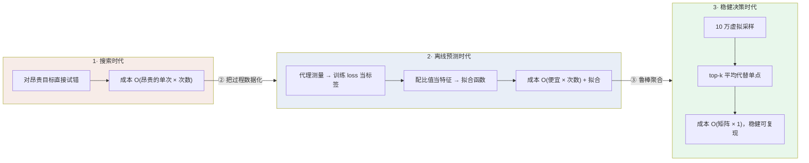
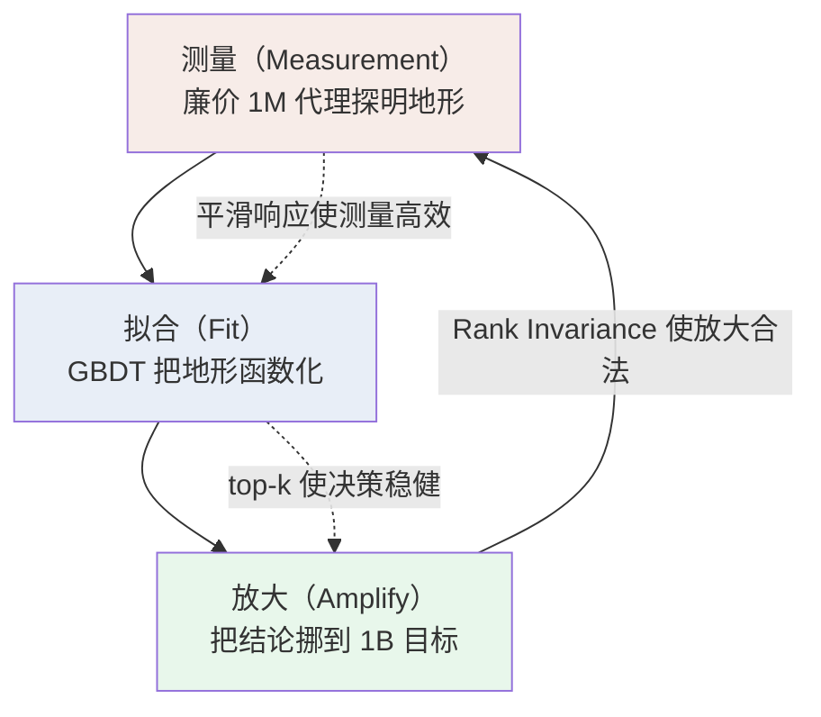

# 第三观 · 深刻不忘观：从"数据混合"到"测量-拟合-放大"的世界观

> 三观递进三部曲 · 第三篇
> 前两篇我们"看见"了全貌、"看懂"了算法。这一篇要回答三个更根本的问题，并把它浓缩成两三句让人永生不忘的话。

---

## 一、总：回望，然后问一个更深的问题

前两篇的发现可以压缩成一句话：
**RegMix 不再"搜索"数据混合，而是"测量"它——先派一批 1M 小模型把"配比→损失"的地形测出来，再让一个 GBDT 把这幅地形学下来，最后在这幅地形上挑最低点放大大模型。**

但停下来，这儿藏着一个真正深刻的问题，也是整项工作的灵魂：

> **为什么"数据混合"这种看起来最玄学、最飘忽、最依赖工程师直觉的东西，居然可以被回归精准地建模？**

"玄学"之所以是玄学，是因为人们相信它不可测量、不可函数化。RegMix 最颠覆性的贡献，不在于用了 LightGBM 或 Dirichlet——这些工具早已存在——**而在于它宣告：数据混合的性能响应，是一张平滑、可测量、可外推的曲面，而非一团无法触碰的迷雾。**

沿着这句话，我们从三个层面逐层登高：**设计哲学 → 框架思想 → 核心主题**。每一层都比上一层更接近本质。

---

## 二、分：三层递进

### 2.1 第一层 · 设计哲学：预测式范式（surrogate-driven，不搜索，先测量）

传统的优化直觉是"搜索"：要么梯度下降，要么穷举试错。但**当目标函数本身贵到无法求值一次**时——训练一个 1B 模型要 2 天、要 8 张 A100——任何"搜索"思路都在经济上破产。RegMix 的解法是把成本转移到一套廉价可复制的**代理（surrogate）**上：

```
搜索范式（Expensive）          RegMix 预测式范式（Cheap）
─────────────────────          ─────────────────────────────
目标: 1B 模型性能（2天/次）     代理: 1M 模型损失（20分钟/次）
在昂贵目标上搜10000次  →        先把"配比→损失"面试探 512 次
→ 不可能                                      再在这面上挑最小值
```



**图注 1：范式跃迁。** 左：在昂贵目标（1B 模型，2 天/次）上"搜索/试错"达上万次 → 成本爆炸；右：先造廉价代理（1M 模型，20 分钟/次）把地形测到足够密、用 GBDT 兜成函数，再在函数上廉价决策并放大到 1B——"先测量，后放大"。

这套心法在更广的科学里并不陌生——它本质上与 **贝叶斯优化 / surrogate-based optimization**、以及**数据中心使用的"小规模实验推断大规模行为"**一脉相承。但 RegMix 把它用到了极致，并且只依赖两个前提：

1. **Rank Invariance（排序不变性）**：配比在 1M 模型上表现的好坏排序，与在 1B/更大模型上的排序大体一致。它给了"用小模型测地形，却敢告诉大模型往哪走"的合法性。
2. **平滑响应**：损失随配比变化是连续平滑的，所以 512 个测点已足够把面摸清、并能外推到未见配比。

> 一句话：**设计哲学是"先富起来一批便宜的探路者，而不是亲自走进高价的迷宫里"**——用可复制的低代价去逼近不可重复的高代价。

### 2.2 第二层 · 框架思想：计算的分层与成本的翻译

把镜头再拉高一点，RegMix 其实是一套关于**怎么花最少的钱，换取最多的"决策信息"**的框架思想，它至少包含三条可复用的原则：

**（1）计算分层（compute tiering）——用廉价的"次数"换昂贵的"单次"**

RegMix 的交易结构是：把"1 次 1B 级试错"拆成"512 次 1M 级、数千次虚拟试错"。回归面一旦建成，单次"试配比"的成本从 2 天降到毫秒级。也就是说，**它把预算从"纵向上增加单次规模"挪到了"横向上增加测量密度"**。这条原则可以平移到任何"昂贵黑盒 + 可复制小样本"的场景。

**（2）把训练"数据化"——过程即数据，模型即测量仪**

RegMix 把代理模型训练产生的 loss 轨迹当成了**数据**（进入回归的标签），把配比向量当成了**特征**，把 `训练次数`当成了**采样样本量**。于是"做实验"变成"采数据点"，"调配方"变成"拟合函数"。这是一种非常可迁移的思维跃迁：**当你能把某个过程变成数据，你就能对这个过程做统计学。**（延伸即"数据驱动实验 / 离线预测管线"。）

**（3）鲁棒决策：用聚合代替单点**

决策阶段用 `top-k 平均`而不是`取全局最小`——这是对**噪声与可复现性**的尊重：图上最尖的点未必真实，平均才是可信的。它提醒我们：**在不确定的地形上做决策，稳健性比峰值更值钱。**



**图注 2：思想演进脉络。** 从"搜索时代"（对昂贵目标直接试错，成本随次数爆炸）→"离线预测时代"（把训练数据化、用代理拟合曲面）→"稳健决策时代"（top-k 聚合代替单点）。三个阶段分别对应计算分层、数据化、鲁棒化三条原则，成本逐级下降。

### 2.3 第三层 · 核心主题升华：数据不是玄学，而是可被靠拢的函数

现在，让我们把镜头拉到最高，回答开头那个"为什么可回归"的拷问：

数据混合之所以长期被当作玄学，是因为**人类对"什么样的数据重要"的判断几乎总是错的**。论文最反直觉的发现正是这一条的注脚：*web 语料（pile_cc）比人们公认的"高质量"维基百科对下游的贡献更强；域之间的交互复杂到常常与常识相悖。* 人脑在 17 维单纯形上做非线性、高交互优化是注定失败的——可**回归模型不在乎"它看起来符不符合直觉"，它只在一簇真实的测量点上，老老实实地把曲面拟合出来**。

于是核心主题可以这样升华：

- **"停止猜测，开始测量。"** 每当一个问题因为太贵、太玄而只能靠专家直觉时，先问一句：我能不能先造一个便宜的替身，把它的响应面测出来？
- **"小尺度揭示大尺度。"** Rank invariance 告诉我们：一簇微小而廉价的实验，足以照亮昂贵而宏大的目标。
- **"稳健远胜尖锐。"** 在噪声地形上，做一个平凡但可复现的正确决定，胜过追求一个不可复现的极致峰值。



**图注 3：核心洞见——测量/拟合/放大黄金三角。** 三个环节互为前提、闭环运行：测量靠平滑响应得以高效，拟合靠 top-k 得以稳健，放大靠 Rank Invariance 得以合法。RegMix 的全部价值，在于把这个三角变成可自动运行的循环。

---

## 三、总：两三句话，让这一切永不忘记

当一切细节褪去，RegMix 留给我们的，是这样一个世界观：

> **数据混合不是不可捉摸的玄学，而是一张可以被廉价模型逼近、被回归函数兜住、再反向放大的平滑响应曲面。**
> **真正的高手不去昂贵而不可导的迷宫里搜索，而是先派一队便宜的探路者把地形测出来，然后在这幅地形图上挑低点。**
> **当某个问题太贵、太玄、只能靠直觉——先造一个便宜的替身，把它测成一张函数。**

三句话，刚好对应三观：
- 第一句是**整体观**：看见了"图"的存在；
- 第二句是**具体观**：看懂了"怎么画图、怎么用图"；
- 第三句是**深刻不忘观**：看透了"这条心法还能用在任何地方"。

从此以后，当你再遇到"很贵又只能拍脑袋"的决策时，你会想起 RegMix——然后问自己那句改天换地的话：**"我能给这个问题造一个便宜的替身吗？"**

---

*三篇完。从"看见"到"看懂"到"看透"，希望这套认知的每一步，你都能记很久。*